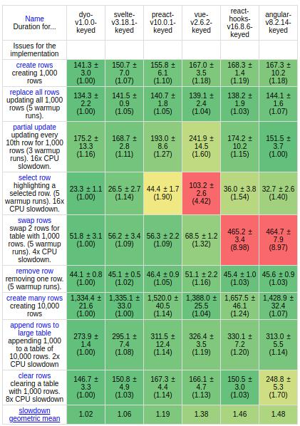
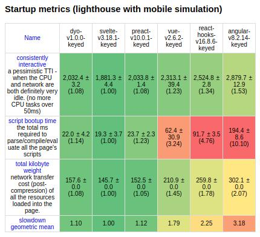

Dyo.jsを知ってほしい
===

フロントエンドフレームワークのトレンドはAngular/React/Vueの三国時代を経て、GoogleのDartによるFlutter for Web、軽量版ReactであるPreact、Vueの思想をベースに更に軽くなったSvelteなど、また新興勢力が新たに出てきて、群雄割拠の戦国時代のようになってきました。

けれど私はこいつを推したい、Dyoです  
https://dyo.js.org

# Dyoって何？
爆速軽量のフレームワークです。  
ちょっとこのフロントエンドベンチマークを比較した表を見てください。  
https://krausest.github.io/js-framework-benchmark/current.html





**圧 倒 的 な パ フ ォ ー マ ン ス ！**

速度は正義！気になりませんか？気になりますよね？それではソースコードを見ていきましょう！

# 環境構築
CDNから呼び出すこともできますが実用的ではないので割愛します。  
create-react-appやVueCliのような便利はものはないので、自力でwebpackの設定をしましょう。
公式ドキュメントは「Webpack完全に理解した」人向けに、Webapckの知識が前提となっているので結構苦労しました汗

まずdyo本体をインストールします。
```
yarn add dyo
```

次にwebpack
```
yarn add -D webpack webpack-cli webpack-dev-server
```

webpack.config.jsはこんな感じにしてください。  
こちらのサイトを参考にしました。

[reactの環境構築-create-react-appを使わずにreactアプリを作る](https://medium.com/@astatsuya/reactの環境構築-create-react-appを使わずにreactアプリを作る-2c0228b31589)  
[新人にドヤ顔で説明できるか、今風フロントエンド開発ハンズオン(Git/Node.js/ES6/webpack4/Babel7)](https://qiita.com/riversun/items/29d5264480dd06c7b9fb)  
[webpack 4 入門](https://qiita.com/soarflat/items/28bf799f7e0335b68186)

```
const path = require("path");

module.exports = {
  mode: "development",
  devServer: {
    open: true,
    openPage: "index.html",
    contentBase: path.join(__dirname, "public"),
    watchContentBase: true,
    host: "0.0.0.0",
    port: 3000,
  },
  entry: { index: "./src/index.js" },
  output: {
    path: path.join(__dirname, "dist/js"),
    publicPath: "/js/",
    filename: '[name].js',
    libraryTarget: 'umd'
  },
  resolve: {
    extensions: [".js", ".jsx"],
  },
  devtool: 'inline-source-map'
};
```

CLIから操作するための設定をpackage.jsonに追記します。
```
"scripts": {
  "serve": "webpack-dev-server",
  "dev": "webpack --config webpack.config.js --mode development",
  "build": "webpack --config webpack.config.js --mode production"
},
```

HTMLと、エントリポイントとなるJSファイルを作ります

```public/index.html
<!DOCTYPE html>
<html lang="en">
<head>
    <meta charset="UTF-8">
    <title>dyo</title>
</head>
<body>
  <main></main>
  <script src="js/index.js"></script>
</body>
</html>
```

```sec/index.js
import {render} from 'dyo'
import(/* webpackChunkName: "app.js" */ './app.js').then(function(module){
  const target = document.querySelector('main')
  render(module.default, target)
})
```

Dyoを実装するapp.jsを作ります
```src/app.js
import {h} from 'dyo'

function app(){
  return(
    h('div', {},
      h('h1', {}, 'Dyo')
    )
  )
}
export default app
```

これで`yarn serve`コマンドでサーバーを起動して`localhost:3000`にアクセスすると、ブラウザに表示が見えていると思います！

# フレームワークを眺めてみよう
dyoからは`h`と`render`という2つの関数が提供されています。これは何でしょうか？  

`render`はHTML ElementをDOMと紐付けてレンダリングさせる関数です。
```
import {render} from 'dyo'

render('Hello, world!', document)
```

`h`は、これはPreactにもあるのですが、HTML Elementを構築する関数です。  
第一引数が要素名、第二引数が属性、第三引数が子要素に対応します。

```
const element = h('h1', {}, 'Hello World')
```

```
function Welcome(props) {
	return h('h1', {}, props.name)
}

render(h(Welcome, {name: 'World'}), document)
```

# Hooksを使う
[公式ドキュメント Hooks](https://dyo.js.org/hooks.html)  
DyoはHooksの機能を使うことが出来ます。まずは`useState`と`useEffect`を試してみましょう。

```src/app.js
import {h, useState, useEffect} from 'dyo'

function app(){
  const [state, setState] = useState('')

  useEffect(function(){
  	document.title = `Hello World`
	})

	return h('form',
		h('h1', {}, state),
		h('input', {
			type: 'text',
			onInput: function(event){setState(event.target.value)}
		})
	)
}
export default app
```

Reactと全く同じですね！DyoではこれらのHooksが使えます
- 状態管理
  - useState
  - useReducer
  - useContext
  - useResource
- ライフサイクル
  - useEffect
  - useLayout
- その他
  - useRef
  - useMemo
  - useCallback

Reactにあるやつがいくつかありますが、ほとんど同じですね。Dyoの`useLayout`はReactの`useLayoutEffect`に相当します。

# ES6を使う
JSをES6の文法を使えるようにしましょう。まずbabelとcore-jsをインストールします。
```
yarn add -D babel-loader @babel/core @babel/preset-env @babel/preset-react core-js@3
```

そして`webpack.config.js`を以下のようにします。
```
const path = require("path");

module.exports = {
  mode: "development",
  devServer: {
    open: true,
    openPage: "index.html",
    contentBase: path.join(__dirname, "public"),
    watchContentBase: true,
    host: "0.0.0.0",
    port: 3000,
  },
  entry: { index: "./src/index.js" },
  output: {
    path: path.join(__dirname, "dist/js"),
    publicPath: "/js/",
    filename: '[name].js',
    libraryTarget: 'umd'
  },

  module: {
    rules: [
      {
        test: /\.jsx$/,
        use: [
          {
            loader: 'babel-loader',
            options: {
              presets: [
                [
                  "@babel/preset-env",
                  {
                    useBuiltIns: "entry",
                    targets: "> 0.25%, not dead",
                    corejs: 3,
                  }
                ]
              ],
            },
          }
        ]
      },
    ]
  },
  resolve: {
    extensions: [".js", ".jsx"],
  },
  devtool: 'inline-source-map'
};
```

`index.js`も書き換えます。`app.js`という拡張子指定がいらなくなるのと、ES6を使うようにします。
```src/index.js
import {render} from 'dyo'
import(/* webpackChunkName: "app" */ './app').then(module=>{
  const target = document.querySelector('main')
  render(module.default, target)
})
```

ではソースコードをES6の文法に書き換えましょう！
```
import {h, useState, useEffect} from 'dyo'

const app=()=>{
  const [state, setState] = useState('')

  useEffect(()=>{
  	document.title = `Hello World`
	})

	return h('form',
		h('h1', {}, state),
		h('input', {
			type: 'text',
			onInput: event=>setState(event.target.value)
		})
	)
}
export default app
```

# JSXを使う
[公式ドキュメント JSX](https://dyo.js.org/introduction.html#introducing-jsx)  
`h`関数でDOMを作っていくのは個人開発では十分かもしれませんが、チームでの開発では厳しくなると思います。ですが大丈夫、DyoではJSXも使えます。  
`webpack.config.js`に設定を追加することで、JSXが使えるようになります。

```webpack.config.js
const path = require("path");

module.exports = {
  mode: "development",
  devServer: {
    open: true,
    openPage: "index.html",
    contentBase: path.join(__dirname, "public"),
    watchContentBase: true,
    host: "0.0.0.0",
    port: 3000,
  },
  entry: { index: "./src/index.js" },
  output: {
    path: path.join(__dirname, "dist/js"),
    publicPath: "/js/",
    filename: '[name].js',
    libraryTarget: 'umd'
  },

  module: {
    rules: [
      {
        test: /\.jsx$/,
        use: [
          {
            loader: 'babel-loader',
            options: {
              presets: [
                [
                  "@babel/preset-env",
                  {
                    useBuiltIns: "entry",
                    targets: "> 0.25%, not dead",
                    corejs: 3,
                  }
                ]
              ],
              plugins: [
                [
                  "@babel/transform-react-jsx",
                  {
                    pragma: "h",
                    pragmaFrag: "Fragment",
                  },
                ],
              ],
            },
          }
        ]
      },
    ]
  },
  resolve: {
    extensions: [".js", ".jsx"],
  },
  devtool: 'inline-source-map'
};
```

ではreturn文の中身をJSXに書き換えます。
```src/app.jsx
import {h, useState, useEffect} from 'dyo'

const app=()=>{
  const [state, setState] = useState('')

  useEffect(function(){
  	document.title = `Hello World`
	})

	return(
    <form>
      <h1>{state}</h1>
      <input type="text" onInput={event => setState(event.target.value)}></input>
    </form>
  )
}
export default app
```

# TypeScriptを使う
DyoはTypeScriptも使えます。TypeScriptをインストールしましょう。
```
yarn add -D typescript ts-loader @types/react
```

webpack.config.jsを書き換え、tsconfig.jsonを作ります。

```webpack.config.js
const path = require("path");

module.exports = {
  mode: "development",
  devServer: {
    open: true,
    openPage: "index.html",
    contentBase: path.join(__dirname, "public"),
    watchContentBase: true,
    host: "0.0.0.0",
    port: 3000,
  },
  entry: { index: "./src/index.js" },
  output: {
    path: path.join(__dirname, "dist/js"),
    publicPath: "/js/",
    filename: '[name].js',
    libraryTarget: 'umd'
  },

  module: {
    rules: [
      {
        test: /\.jsx$/,
        use: [
          {
            loader: 'babel-loader',
            options: {
              presets: [
                [
                  "@babel/preset-env",
                  {
                    useBuiltIns: "entry",
                    targets: "> 0.25%, not dead",
                    corejs: 3,
                  }
                ]
              ],
              plugins: [
                [
                  "@babel/transform-react-jsx",
                  {
                    pragma: "h",
                    pragmaFrag: "Fragment",
                  },
                ],
              ],
            },
          }
        ]
      },
      {
        test: /\.tsx?$/,
        use: "ts-loader"
      }
    ]
  },
  resolve: {
    extensions: [".ts", ".tsx", ".js", ".jsx"],
  },
  devtool: 'inline-source-map'
};
```

```tsconfig.json
{
  "compilerOptions": {
    "sourceMap": true,
    "target": "es5",
    "module": "esnext",
    "jsx": "react",
    "jsxFactory": "h",
    "moduleResolution": "node",
    "lib": [
      "es2020",
      "dom"
    ]
  }
}
```

`app.tsx`をTypeScriptの書き方に変えましょう。
```src/app.tsx
import {h, useState, useEffect} from 'dyo'

const app=()=>{
  const [state, setState] = useState('')

  useEffect(function(){
  	document.title = `Hello World`
  })

  function handleInput(event:Event):void {
    let target = event.target as HTMLInputElement
    setState(target.value)
  }

	return(
    <form>
      <h1>{state}</h1>
      <input type="text" onInput={event => handleInput(event)}></input>
    </form>
  )
}
export default app
```

# ルーターを使う
Dyoは3rdパーティライブラリを使うことでルーターが使えるようになります。Dynamic Importを使った遅延評価によって高速なファーストインプレッションができます。

```
yarn add https://github.com/TongChia/dyo-router
```

`app`の中にルーティングを書きましょう。これはTypeScriptだと上手くいかなかったので…拡張子を`.jsx`にします。

ディレクトリはこんな感じ
```
├── public
│   └── index.html
├── src
│   ├── app.jsx
│   ├── components
│   │   ├── home.tsx
│   │   ├── page1.tsx
│   └── index.js
├── tsconfig.json
├── webpack.config.js
└── yarn.lock
```

```src/app.jsx
import { lazy } from "dyo";
import { createRouter } from "dyo-router";

const router = createRouter([
  {
    path: "/",
    component: lazy(() => import('./components/home').then(module => module.default)),
  },
  {
    path: "/page1",
    component: lazy(() => import('./components/page1').then(module => module.default)),
  },
]);
export default router;
```

```src/components/home.tsx
import {h, useState, useEffect} from 'dyo'

const home=()=>{
  const [state, setState] = useState('')

  useEffect(function(){
  	document.title = `Hello World`
  })

  function handleInput(event:Event):void {
    let target = event.target as HTMLInputElement
    setState(target.value)
  }

	return(
    <div>
      <h1>Home</h1>
      <p><a href="/#!/page1">page1</a></p>
      <h1>{state}</h1>
      <input type="text" onInput={event => handleInput(event)}></input>
    </div>
  )
}
export default home
```

```src/components/page1.tsx
import {h} from 'dyo'

const page1=()=>{
  return (
    <div>
      <h1>Page1</h1>
      <p><a href="/#!/">home</a></p>
    </div>
  )
}
export default page1
```

# サーバーサイドレンダリングしてみる
DyoではSSRもできます。